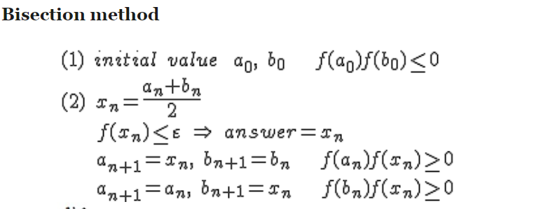
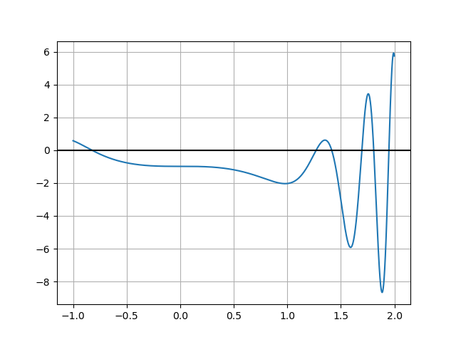

In general, the code is in Python 3.7 and requires having the matplotlib library to run.  
Run CircleArea.py to get the area of the circle.  
Run HeartArea.py to get the area of the heart minus the circle.  
Run Bisection Method.py to get the roots and graph for problem 2.  

# Problem #1

## Setup
In the first problem, we are asked to dig out the maximum possible disc from a heart equation that was given. Then after scooping that disc out, we had to find the area of the heart using a numerical method. 

## Algorithm Description: Finding the Area of the Circle
In order to find the size of the disc, I decided to use numerical methods. From Professor Deng's image of the circle, I knew that any disc of maximal size would have it's center on the y-axis. Also, the top of the circle would be touching the uppermost point where the two halves of the heart meet. Furthermore, the picture also told us that the largest circle possible would be tangent to the lower portion of the heart. Using this, I created a method that would generate points on the lower portion of the curve, that is governed by the red equation in the image attached. These points started from the leftmost position and were spaced 0.0005 units apart.

I then used a for loop to go from the cusp of the heart, down the y-axis to check whether or not a circle with that point as its center would hit any of the pre-selected points on the circumference of the heart. As soon as a circle was found to have intersected a point on the heart, the algorithm would return the previous center that didn't intersect. This would be the center of the circle, which I would then subtract from the area of the heart by itself

## Algorithm Description: Finding the Area of the Heart
I broke the heart up into two functions and placed them up against x-axis in order to do the rectangle rule on it. This is shown in the image below.

I then used rectangles of width 0.0001 to find the total area of the heart. Finally, I subtracted the area of the circle that I got from the previous algorithm and got my answer.

## Pseudocode:
    def circle_radius():
  
      generate the centers along y-axis
      generate the points along the lower portion of the heart
       
      for center in centers:
          for point in heart_points:
              if distance from heart point to center < potential radius
                  return last valid center

    def lower_area():
        for points along x-axis separated by 0.0001 units:
          Find f((a0 + b0)/2) and multiply by 0.0001 and then add to total area

    def upper_area():
      for points along x-axis separated by 0.0001 units:
        Find g((a0 + b0)/2) and multiply by 0.0001 and then add to total area

    def heart_area():
        upper_area() + lower_area()
    
    radius = circle_radius
    return heart_area() - pi * radius^2
    
## Answer:
Circle Area Approximately: **3.3506** 
Heart Area Approximately: **6.2832** 
**Heart Minus Circle Area Approximately: 2.9325** 
        
Total Floating Point Operations:
5656 heart points * 5 operations +
28284 center points * 1 operation +
10328 center points * 5656 heart points * 5 ops to find distance = 292,132,404 operations  

Upper: 28283 points * 7 ops + 28283 (1 sum in numerator + 1 divisions by 2 + 1 multiply by 0.0001 + 1 adding to current answer) = 311,113  
Lower: 28283 points * 7 ops + 28283 (1 sum in numerator + 1 divisions by 2 + 1 multiply by 0.0001 + 1 adding to current answer) = 311,113  

1 operation to add upper and lower + 
1 operation to square circle's radius +
1 operation to multiply circle's radius by pi +
1 operation to subtract circle from heart = **292,754,634 operations**  

# Problem #2

## Setup
In the second problem we had to use a numerical method in order to find the roots of the function provided to us.

## Algorithm Description: Bisection
To plot the graph I used the matplotlib library of python. The algorithm I used to find root was the bisection method. It takes a guess root and a range that surrounds the root and narrows down to the root within 0.0001 accuracy. The guesses and the ranges are listed below:  
1st Root Guess: -0.85; Range: .05  
2nd Root Guess: 1.26 ; Range: .02  
3rd Root Guess: 1.42 ; Range: .02  
4th Root Guess: 1.68 ; Range: .02  
5th Root Guess: 1.80 ; Range: .02  
6th Root Guess: 1.94 ; Range: .02  

## Pseudocode
The pseudocode is provided in the image below from Professor Deng's notes

## Answer:
The graph is in the image directly below

Finally, the roots are:  
**-0.8243  
1.2692  
1.4143  
1.6956  
1.8067  
1.9483**  

