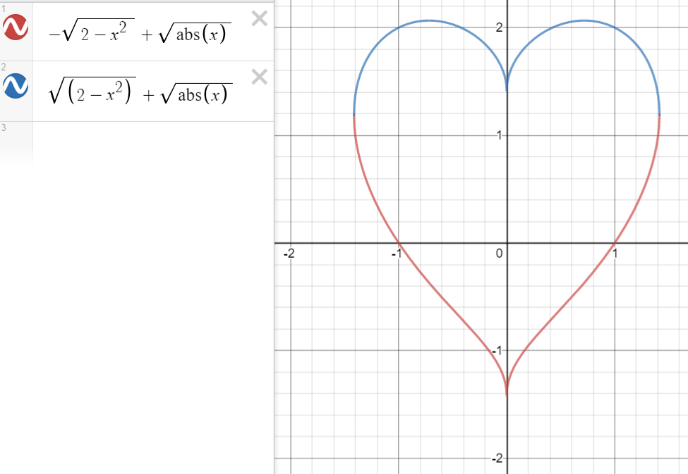
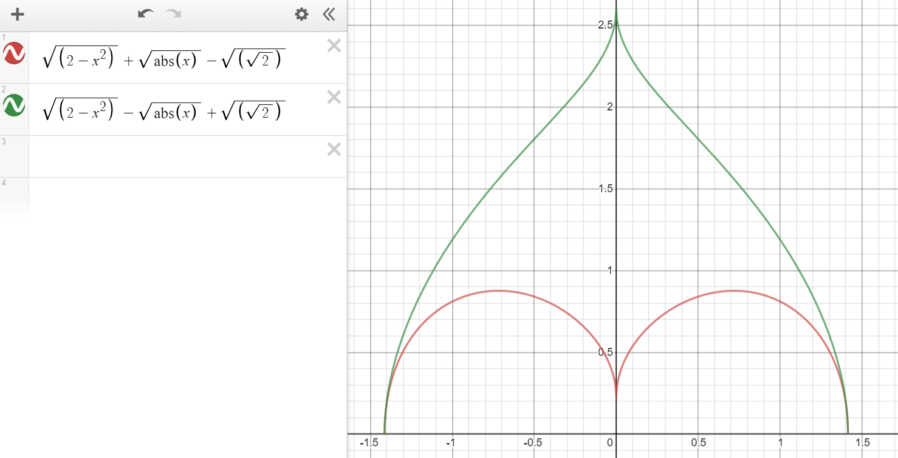

# Problem #1

## Setup
In the first problem, we are asked to dig out the maximum possible disc from a heart equation that was given. Then after scooping that disc out, we had to find the area of the heart using a numerical method. 

## Algorithm Description: Finding the Area of the Circle
In order to find the size of the disc, I decided to use numerical methods. From Professor Deng's image of the circle, I knew that any disc of maximal size would have it's center on the y-axis. Also, the top of the circle would be touching the uppermost point where the two halves of the heart meet. Furthermore, the picture also told us that the largest circle possible would be tangent to the lower portion of the heart. Using this, I created a method that would generate points on the lower half of the curve, that is governed by the blue equation in the image attached. These points started from the leftmost position and were spaced 0.0005 units apart.

I then used a for loop to go from the cusp of the heart, down the y-axis to check whether or not a circle with that point as its center would hit any of the pre-selected points on the circumference of the heart. As soon as a circle was found to have intersected a point on the heart, the algorithm would return the previous center that didn't intersect. This would be the center of the circle, which I would then subtract from the area of the heart by itself

## Algorithm Description: Finding the Area of the Heart
I broke the heart up into two functions and placed them up against x-axis in order to do the rectangle rule on it. This is shown in the image below.

I then used rectangles of width 0.0001 to find the total area of the heart. Finally, I subtracted the area of the circle and got my answer.
